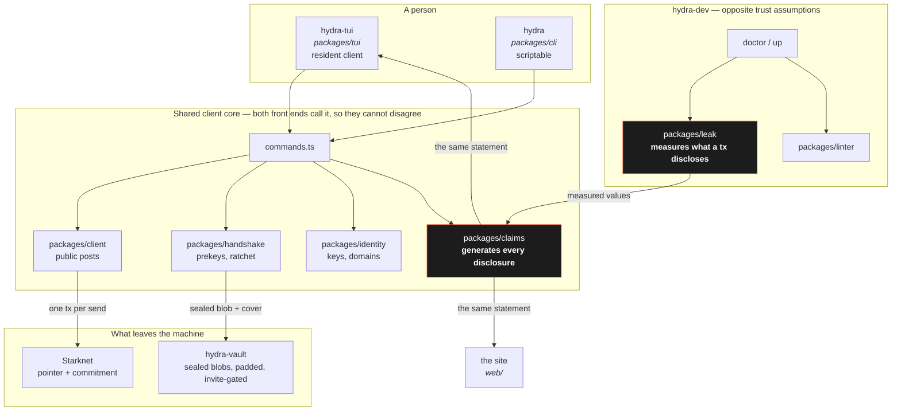
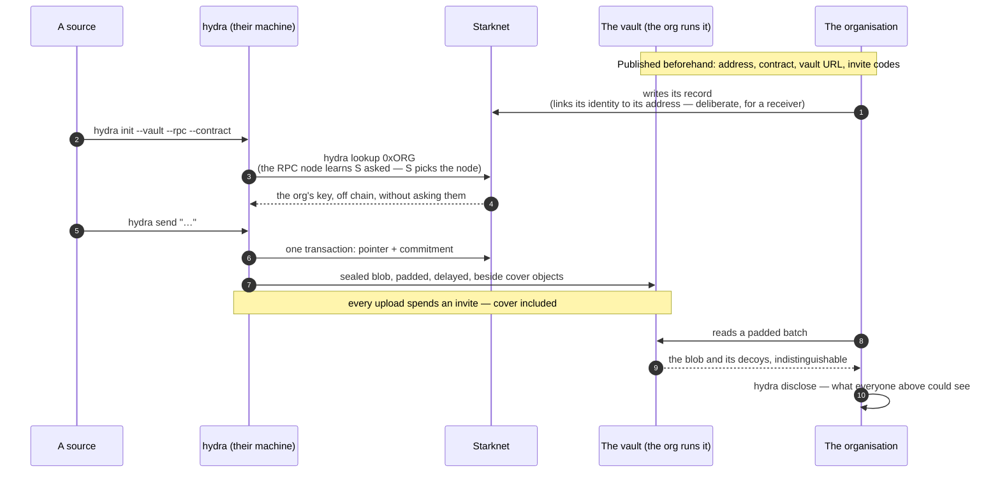

# HYDRA

**Private messaging on Starknet, and the tooling that measures what it discloses.**

[](LICENSE)
[](devtool/package.json)
[](hydra-dapp)
[](devtool)
[](web)

> ### ⚠️ Testnet, and unaudited in a specific way
>
> The channel contract is **deployed on Sepolia and nowhere else** — see
> [`deployments/sepolia.json`](deployments/sepolia.json). It has **had no external audit**: 98 lines
> of Cairo, one storage slot, no owner, no upgrade path, no custody. That is a small surface, not a
> reviewed one.
>
> The **disclosure statement is generated** from the code that makes it true. The **deployment is
> not**: nothing on chain has been reviewed by anyone outside this repository.

---

## Two products, one repository

| | |
|---|---|
| **`hydra`** | Private messaging. A message is sealed, padded and uploaded to storage on a delayed schedule; a pointer and a commitment go on chain. Neither on-chain value names a sender, a recipient, or a message. |
| **`hydra-dev`** | STRK20 correctness and disclosure tooling. Brings up a local privacy stack, and computes what a planned transaction would disclose before it is sent. |

They share a repository and **not a dependency path**. A messaging client and an operator tool have
opposite trust assumptions, and invariant **I8** keeps them apart — separate binaries, separate
packages, enforced by
[`i8-operator-separation.test.ts`](hydra-dapp/packages/adversary/test/i8-operator-separation.test.ts).

The platform client declares **one** dependency across all its packages. The devtool's terminal
interface pulls forty. That difference is the point: the client process holds a root key, so every
package in its tree is a package that can read the state file.

---

## The background

**1. Encrypting the message is the easy half.**
Everyone does that. What survives encryption is *who talked to whom, when, and how often* — and on a
public chain that metadata is permanent and free to read. This client spends its effort there: a
message's chain event is separated in time from its upload, and the upload travels beside cover
objects that are indistinguishable from it.

**2. What leaks is computed, never promised.**
`hydra disclose` prints what every party in the system can see, and each row is generated from the
value that makes it true rather than written by hand. The marketing site renders the *same*
statement from the *same* function. They cannot drift, because there is only one of them.

**3. We measured the pool, found a disclosure gap, and told StarkWare first.**
Two patches against `starknet-privacy` are prepared and unsent. They go privately, together, with a
window to respond, before anything public. *A defensible design choice, but not a defensible
undisclosed one.*

---

## Install

```bash
git clone <this repo> && cd hydra/devtool
npm install
npx hydra-dev up
```

**Three steps — and here is what they assume.** They assume a machine that already has the
toolchain: Node ≥ 24, `scarb`, `snforge` (which brings `universal-sierra-compiler`),
`starknet-devnet`, and a Rust toolchain. **From a bare machine, add one install per missing tool** —
this project will not run those for you, and `doctor` prints the exact command for each.

`hydra-dev doctor` reports every one with the exact version wanted and the command that installs
it. How many rows it prints tells you where you are:
**eight** before the checkout exists, and **fourteen** once it does — the six build artifacts
are the difference.
`up` asks before each third-party install and shows the command first; `--yes` consents in advance,
and with no terminal it **refuses rather than assuming**.

**Step 3 takes a few minutes on a cold checkout** — around two of Cairo compilation, plus a Rust
build and two npm installs. Silence is `cargo` or `npm`, not a hang.

For the messaging client:

```bash
cd hydra/hydra-dapp && npm install
npx hydra-tui
```

---

## Architecture



**The load-bearing edge is `LEAK → CLAIMS → {TUI, SITE}`**, and it is the only one in the accent
colour. It is why the product and its marketing cannot drift.

**`identity` and `vault-client` are deliberately absent from the site's side.** Invariant **I6** —
no key-handling code in a browser context — and
[`module-graph.ts`](web/scripts/module-graph.ts) fails the build if any page can reach them.

---

## The flow, source to organisation



**A source needs no prior relationship with the organisation.** `hydra lookup` reads their key off
chain from their Starknet address — no file exchanged in either direction. Before that existed, a
source needed a prior relationship with the organisation they were anonymously contacting, which
undid the premise.

**The note between `C` and `V` is the one an organisation gets wrong.** An invite code handed to one
named person is an identity that arrives in the same request as their object. Published as a pool,
it is not. The receiving guide covers it; the vault says so in its own startup banner, every run.

---

## Disclosure

Most projects put this in a footnote. It is the product.

```
$ hydra disclose
- Whoever runs the storage server can see the blob id, for every stored object.
- Whoever runs the storage server can see the padded size bucket, not the true length.
- Whoever runs the storage server can see which objects arrived together.
- The chain shows that YOU published, and in what order.
…
```

Every row is generated from the mechanism that makes it true. There is no hand-written list to fall
out of date, and the site renders the same rows from the same function.

The client also reports **how linkable a conversation currently is** — a crowd size read from the
chain, with the sentence that qualifies it always attached. On a quiet chain that number is **zero**,
and the client says so plainly rather than rounding it up.

---

## Deployed

| | |
|---|---|
| Network | Starknet **Sepolia** |
| Record | [`deployments/sepolia.json`](deployments/sepolia.json) — address, class hash, transaction, block, finality, and the two queries that re-derive it |
| Mainnet | **Not deployed.** Cost measured against live mainnet prices from the Sepolia deployment's own resource usage: **~1.15 STRK** to declare and deploy, **~0.032 STRK** per message |

`strk20.json` is empty, and that is deliberate. Populating it means writing a record on mainnet,
which **permanently and publicly links a Starknet account to a messaging identity** — the disclosure
this product is loudest about. A project whose argument is that it computes what leaks does not make
that link early to fill in a submission field.

---

## Where things live

| capability | code |
|---|---|
| Sealing, padding, cover traffic | [`packages/channel`](hydra-dapp/packages/channel) |
| Prekeys, inbox, ratchet | [`packages/handshake`](hydra-dapp/packages/handshake) |
| Every generated disclosure | [`packages/claims`](hydra-dapp/packages/claims) |
| Terminal interface | [`packages/tui`](hydra-dapp/packages/tui) |
| Loopback API the browser drives | [`packages/gui`](hydra-dapp/packages/gui) |
| Self-hostable storage | [`packages/vault-server`](hydra-dapp/packages/vault-server) |
| What a transaction discloses | [`devtool/packages/leak`](devtool/packages/leak) |
| STRK20 configuration linting | [`devtool/packages/linter`](devtool/packages/linter) |

```
hydra/
├── hydra-dapp/      the messaging client — 13 packages, 716 tests
│   └── contracts/   98 lines of Cairo: one counter, two felts, no owner
├── devtool/         hydra-dev — 7 packages, 76 checks
├── web/             the site — 27 tests, no key-handling code by invariant
└── deployments/     what is on chain, and how to re-derive it
```

---

## Development

```bash
cd hydra-dapp && npm test     # 716
cd devtool    && npm test     # 76 checks, 9 files
cd web        && npm test     # 27
```

The suites are the argument. A claim in this repository is expected to name the mechanism that
makes it true and the test that would fail if it stopped being true — and a check that cannot fail
is treated as worse than no check at all.

## Licence

[Apache-2.0](LICENSE), matching upstream, so contributions flow both ways.

The wordmark face and the mark used on the site are **not** covered by it and are excluded from any
public build — see [`web/scripts/assert-public.ts`](web/scripts/assert-public.ts).
