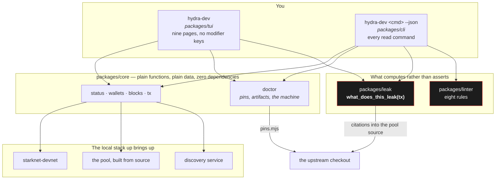
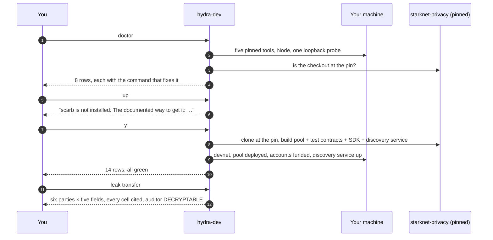

# hydra-dev

**A local STRK20 privacy stack, and tooling that computes what a transaction actually discloses.**

[](../LICENSE)
[](package.json)
[](packages/cli/test)
[](package.json)

> ### ⚠️ This does not vendor the privacy pool, and every number here is about one commit of it
>
> `hydra-dev` drives a checkout of [`starknet-privacy`](https://github.com/starkware-libs/starknet-privacy)
> pinned to a single revision, held in [`packages/cli/src/pins.mjs`](packages/cli/src/pins.mjs)
> alongside the exact version of every tool that builds it. The stack is a **local devnet**. Nothing
> here deploys to mainnet, and the pool's own auditor keys differ between networks — so a result
> measured on one network does not transfer to another, and `leak` reports `UNKNOWN` rather than
> guessing which is in force.
>
> **It also will not install a toolchain for you.** See *What it refuses to do*, below. That is the
> most unusual thing about this tool and it is deliberate.

---

## What it is

| | |
|---|---|
| **`doctor`** | Every version this stack needs, what you have, and the exact command that installs what you do not. It is the honest starting point when anything is wrong. |
| **`up`** | Clones the pool at the pin, builds it, and starts devnet + the deployed pool + funded accounts + a local discovery service. Asks before each third-party install. |
| **`leak`** | Given a described transaction *and the configuration it will run under*, the disclosure set: six parties × five fields, every cell computed and cited. |
| **`lint`** | Flags STRK20 SDK configurations that disclose more than intended — eight rules, each carrying the pool source it was derived from. |

Nothing it reports is asserted. Every claim is computed from the pool source or measured, and
carries a `file:line` citation.

---

## The background

**1. A stack you cannot stand up is a stack you cannot check.**
Getting upstream's e2e suite green took a day of undocumented traps — a devnet that blackholes
unbound loopback ports under WSL2, a Cairo project that needs `--ignore-cairo-version`, a compiler
that ships with `snfoundryup` and appears in no `.tool-versions`. Every one of them is a row in
`doctor` or a line it prints, rather than knowledge somebody has.

**2. `UNKNOWN` is never rendered as a pass.**
The disclosure matrix distinguishes *this transaction does not place the value where that party can
read it* from *we do not know*, and says so on screen every time. `NOT_DISCLOSED_BY_THIS_TX` is
glossed, in the output itself, as **not** a privacy claim — it is scoped to one transaction and says
nothing about correlation across transactions, off-chain side channels or prior knowledge
([`packages/leak/src/facts.mjs`](packages/leak/src/facts.mjs)).

**3. The auditor row is enforced, not written.**
An invariant test asserts that for every case, every action and every field, the auditor cell is
`DECRYPTABLE`. No configuration changes it: the key is read from contract storage rather than user
input, and both live pools return a non-zero one. A row that cannot be softened by a config is a row
worth trusting.

---

## Install

```bash
git clone https://github.com/charlesms1246/hydra.git && cd hydra/devtool
npm install
npx hydra-dev up
```

**Three steps, and they assume a machine that already has the toolchain**: Node ≥ 24, `scarb`,
`snforge`, `starknet-devnet`, `universal-sierra-compiler` and a Rust toolchain. From a bare machine
each of those is a separate third-party install, and this project runs none of them without asking.

`hydra-dev doctor` reports every one with the version wanted, the version found, and the command
that fixes it. How many rows it prints tells you where you are: **eight** before the checkout exists
— Node, the five pinned tools, one property of the machine, and the checkout itself — and
**fourteen** once it does, the six build artifacts being the difference.

```
$ npx hydra-dev doctor
  [ok  ] scarb                    want 2.18.0         got 2.18.0
  [WARN] loopback refuses         want ECONNREFUSED   got blackholed
  [ok  ] upstream checkout        want 980da8affafb   got 980da8affafb
  [ok  ] artifact: poolTestContracts want 47 files       got 47 present
```

**A cold `up` takes a few minutes** — around two of Cairo compilation, plus a Rust build and two npm
installs. Silence is `cargo` or `npm`, not a hang.

`doctor` needs no dependencies of its own, so it works before `npm install` does.

---

## What it refuses to do

`scarb`, `snforge`, `starknet-devnet` and `cargo` are all installed by piping a remote script into a
shell. **A program that does that on your behalf because you typed `up` has made a decision that was
yours.** So ([`packages/cli/src/setup.mjs`](packages/cli/src/setup.mjs)):

- **One question per install, never a blanket yes.** Five downloads behind one prompt is consent
  nobody gave.
- **The exact command, and where it fetches from, printed before it runs.** So "yes" answers a
  specific question.
- **No terminal means no.** With no TTY — CI, an agent, a pipe — it reports what is missing and
  exits. `--yes` consents in advance and has to be typed. *A TTY check that reads "no terminal" as
  consent is how a build machine runs an installer nobody approved.*
- **A tool present at the wrong version is left alone** and reported. Replacing a toolchain you
  already have is a larger decision than installing one you lack.

---

## Architecture



**One `core`, two front ends.** The TUI and the CLI call the same functions and render the same
objects, so a page and its `--json` twin cannot disagree about what the stack is doing. `core`
declares no dependencies at all.

---

## What a run looks like



**Step 5 is the whole posture in one line.** It prints the command, names the vendor it fetches
from, and waits. Answer no and it tells you what is still missing and stops.

---

## Disclosure

```
$ npx hydra-dev leak transfer
  transfer · discovery indexer-self-hosted · proving mock · network UNKNOWN · upstream 980da8af

                              amount                    counterparty  timing  addresses
  public chain observer       NOT_DISCLOSED_BY_THIS_TX  UNKNOWN       CLEAR   UNKNOWN
  the counterparty            CLEAR                     CLEAR         CLEAR   CLEAR
  discovery service operator  CLEAR                     CLEAR         CLEAR   CLEAR
  the auditor                 DECRYPTABLE               DECRYPTABLE   DECRYPTABLE  DECRYPTABLE

  NOT_DISCLOSED_BY_THIS_TX is NOT a claim of privacy, and UNKNOWN is never a pass
  always    The auditor row is DECRYPTABLE for every field of every action, under every
            configuration. Escrow is mandatory, contract-enforced and user-uncontrollable.
```

`--json` carries every cell's `why` and its `file:line` citations, so a result can be traced to the
line of Cairo that makes it true. Every read command takes `--json`, which is what makes this
usable by an agent as well as a person.

---

## Where things live

| capability | code |
|---|---|
| Every operation as a plain function returning plain data | [`packages/core`](packages/core) |
| `doctor`, `up`, the command surface | [`packages/cli`](packages/cli) |
| The terminal interface | [`packages/tui`](packages/tui) |
| `what_does_this_leak(tx)` | [`packages/leak`](packages/leak) |
| STRK20 configuration linting | [`packages/linter`](packages/linter) |
| Every pinned version, in one place | [`packages/cli/src/pins.mjs`](packages/cli/src/pins.mjs) |
| What `up` will and will not do for you | [`packages/cli/src/setup.mjs`](packages/cli/src/setup.mjs) |

Five packages ship in this tarball. `leak` and `linter` each carry their own README with the
per-party table and the rule table.

---

## Development

```bash
npm test          # 164 checks across 10 files — an npm install runs 129 of them, see below
npx hydra-dev doctor
```

**164 in a checkout, 129 from an `npm install`, and both are measured rather than derived.** Two
packages are withheld from the published tarball, so an install runs 9 of the 10 files and the
suite says which one it did not run and why. The difference is not simply the missing file's 31
checks: some checks in the other suites skip when the withheld directories are absent, and they
name that precondition when they do. **Run it and read the last line** — the run prints its own
total, which exists because two people derived this number by hand and both got it wrong, in the
same direction, for two different reasons.

The suite is the argument. A claim here is expected to name the mechanism that makes it true and
the check that would fail if it stopped being true — including the numbers in this file: the row
counts above are read out of it and compared against what `doctor` actually prints, in
[`packages/cli/test/guards.mjs`](packages/cli/test/guards.mjs), with the command run both with a
checkout and without.

## Licence

[Apache-2.0](../LICENSE), matching upstream, so contributions flow both ways.
