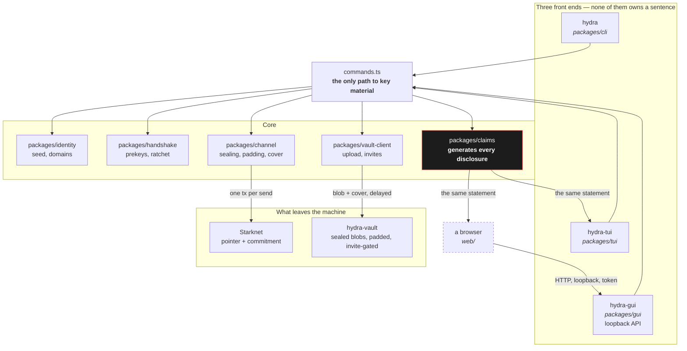
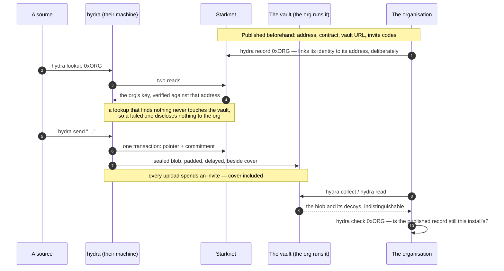

# hydra

**A messaging client that computes what it discloses, and shows you the answer.**

[](../LICENSE)
[](package.json)
[](packages/adversary)
[](packages)
[](packages/channel/package.json)

> ### ⚠️ Testnet, and unreviewed in three specific ways
>
> **The protocol composition is ours.** The primitives are Node's — X25519, Ed25519, AES-GCM and
> HKDF from `node:crypto` — but the prekey exchange, the ratchet and the sealing around them are
> written in [`packages/handshake`](packages/handshake) and have had **no external review**. A
> correct primitive assembled wrongly is still wrong.
>
> **The contract is deployed on Sepolia and nowhere else** — see
> [`deployments/sepolia.json`](../deployments/sepolia.json). 30 lines of Cairo, no storage at all,
> no owner, no upgrade path, no custody. A small surface, not a reviewed one.
>
> **Publishing a record is permanent and public.** `hydra record` links a Starknet address to a
> messaging identity, on chain, forever — and everything that address ever does joins to your
> conversations for anyone reading. It is the loudest disclosure this client makes, which is why no
> command does it for you.

---

## What it is

A message is sealed, padded to a size bucket, and uploaded to storage on a **delayed** schedule,
travelling beside cover objects indistinguishable from it. Separately, one transaction puts a
pointer and a commitment on chain. Neither on-chain value names a sender, a recipient, or a
message.

Encrypting the message is the easy half. What survives encryption is *who talked to whom, when, and
how often*, and on a public chain that is permanent and free to read. The effort in this client is
spent there.

---

## The background

**1. What leaks is computed, never promised.**


`hydra disclose` prints **58** rows describing what every party can see, and each is generated from
the value that makes it true rather than written by hand. The terminal interface and the marketing
site render the *same* statement from the *same* function in
[`packages/claims`](packages/claims). They cannot drift, because there is only one of them. A
sentence about privacy that is not derived from a mechanism is not shipped.

**2. Three front ends, one core, so they cannot disagree.**
A scriptable CLI, a resident terminal interface, and a loopback HTTP API a browser drives all call
[`packages/cli/src/commands.ts`](packages/cli/src/commands.ts). Where they each rendered a claim in
their own words, the claim moved to one array and
[`claims-not-duplicated.test.ts`](packages/adversary/test/claims-not-duplicated.test.ts) fails if
any surface drops one or restates it. Every drift that test exists for was a real one, found after
it shipped.

**3. A source needs no prior relationship.**
`hydra lookup 0xADDRESS` reads a peer's key off chain, with no file exchanged in either direction.
Before it existed a source could only reach an organisation they already had a relationship with —
a prerequisite sitting in front of the surface, undoing its premise.

**4. Every guarantee has a test that would fail without it, and a check that cannot fail is worse
than no check.**
Negative results are held to a floor: a guard that reports "nothing found" must first prove it
looked. Several of the tests here exist because a previous version of the same guard passed on an
empty corpus.

---

## Install

```bash
cd hydra/hydra-dapp && npm install
npx hydra-tui
```

`npm install` links four binaries: `hydra` (scriptable), `hydra-tui` (resident), `hydra-vault`
(storage, for an operator), and `hydra-gui` (the loopback API a browser talks to).

A fresh `hydra init` **succeeds and cannot send anything** — no contract, no invites, no publishing
account. It says so at that moment rather than leaving you to discover it: the missing settings are
reported with where each one comes from, and **the vault and the invites come from whoever you are
contacting, not from you.** See [`packages/claims/src/setup.ts`](packages/claims/src/setup.ts).

---

## Architecture



**The browser reaches `identity` and `vault-client` through nothing.** It speaks HTTP to a local
process and renders JSON. That is invariant **I6** — no pool viewing key and no vault content key in
a browser context — and [`module-graph.ts`](../web/scripts/module-graph.ts) walks the static import
graph and fails the build if any page can reach them. It counts `import type` edges too, which the
bundler erases: an over-approximation, so it produces false alarms and never a false pass.

**The vault server is an operator surface and ships as its own binary.** Invariant **I8**: operator
capabilities never arrive as a subcommand on a user's client, and the two do not share a dependency
path. [`i8-operator-separation.test.ts`](packages/adversary/test/i8-operator-separation.test.ts)
holds it.

---

## The flow, source to organisation



**The ordering in step 3 is a security property, not an optimisation.** The node is asked first, and
only a record whose signature names that address reaches the vault — so a mistyped address never
writes a prekey message into a stranger's mailbox, and a failed lookup tells the organisation
nothing. The claim that says so is rendered from one array on all three front ends, and a test fails
if a second route to a bundle is ever added beside it.

**Step 8 exists because both sides can be told a true sentence and neither the one that matters.**
Delete a state file, re-run `init`, and a published record goes on naming an identity you no longer
hold: sources reach the old key, their messages land in a mailbox this install cannot derive, and
`collect` reports nothing waiting. `hydra check` compares the two fingerprints. It reads the chain
rather than a stored field, because the state that would have remembered is what was deleted.

---

## Disclosure

Most projects put this in a footnote. It is the product.

```
$ hydra disclose
- Whoever runs the storage server can see the blob id, for every stored object.
- Whoever runs the storage server can see the padded size bucket, not the true length.
- Whoever runs the storage server can see which objects arrived together.
- The chain shows that YOU published, and in what order.
…
```


58 rows, every one generated from the mechanism that makes it true.

The client also reports **how linkable a conversation currently is** — a crowd size read from the
chain, with the sentence that qualifies it always attached, so the reassuring number can never
appear without it. On a quiet chain that number is zero and the client says so plainly rather than
rounding up.

What the timing defence does and does not buy is measured rather than asserted, in
[`i3-timeline-join.test.ts`](packages/adversary/test/i3-timeline-join.test.ts) and
[`i3-cover-traffic.test.ts`](packages/adversary/test/i3-cover-traffic.test.ts) — including the
undefended case, so the gap is recorded rather than implied.

Attribution is three-valued and the mark is two, so every message carries the basis of its claim
rather than a tick a reader has to interpret:
[`i7-attribution.test.ts`](packages/adversary/test/i7-attribution.test.ts).

---

## Deployed

| | |
|---|---|
| Network | Starknet **Sepolia** |
| Record | [`deployments/sepolia.json`](../deployments/sepolia.json) — address, class hash, transaction, block, finality, and the two queries that re-derive it |
| Contract | [`contracts/src/channel.cairo`](contracts/src/channel.cairo) — one `u64` counter, two felts per message, no owner |
| Mainnet | **Not deployed.** The reason, and the measured cost, are in the [root README](../README.md) |

---

## Where things live

| capability | code |
|---|---|
| Sealing, padding, cover traffic | [`packages/channel`](packages/channel) |
| Prekeys, inbox, ratchet | [`packages/handshake`](packages/handshake) |
| Seed and key derivation | [`packages/identity`](packages/identity) |
| Every generated disclosure | [`packages/claims`](packages/claims) |
| Scriptable interface | [`packages/cli`](packages/cli) |
| Resident terminal interface | [`packages/tui`](packages/tui) |
| Loopback API a browser drives | [`packages/gui`](packages/gui) |
| Self-hostable storage, operator-side | [`packages/vault-server`](packages/vault-server) |
| Public posts | [`packages/client`](packages/client) |
| Every guard in this table | [`packages/adversary`](packages/adversary) |

Two files are worth reading before changing anything near them:
[`packages/claims/src/warnings.ts`](packages/claims/src/warnings.ts), which holds every claim both
front ends and the browser render, and
[`packages/gui/src/serialise.ts`](packages/gui/src/serialise.ts), which explains why an HTTP server
needs a write lock that the terminal interface gets for free.

---

## Development

```bash
npm test        # 716
```

That runs a typecheck, a citation check, and the suites. The citation check reads every backticked
path in every tracked document and fails on one a reader of a clone could not open.

The suites are the argument. A claim here is expected to name the mechanism that makes it true and
the test that would fail if it stopped being true. Guards are mutation-tested in both directions —
made to fail on the defect they describe, and to pass once it is fixed — because a guard nobody has
seen fail is a guard nobody has tested.

## Licence

[Apache-2.0](../LICENSE).
